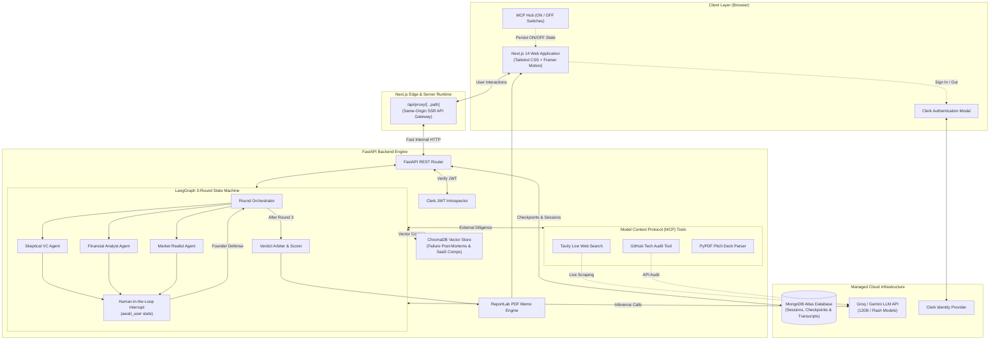

# 😈 Devil's Advocate Panel

> **Autonomous Multi-Agent AI Investment Committee that stress-tests startup pitches, uncovers fatal assumptions, and generates institutional-grade investment memos.**

[](https://nextjs.org/)
[](https://fastapi.tiangolo.com/)
[](https://langchain-ai.github.io/langgraph/)
[](https://www.mongodb.com/atlas)
[](https://clerk.com/)
[](LICENSE)

---

## 🌐 Live Web Application

Experience the live multi-agent investment gauntlet:

👉 **[https://devils-advocate-frontend.onrender.com](https://devils-advocate-frontend.onrender.com)**

---

## ❓ What it does ?

**Devil's Advocate Panel** is an interactive, multi-agent AI crucible that puts startup pitches through the exact rigors of an elite Tier-1 venture capital partner meeting.

1. **Intake Pitch Dossier & PDF Deck**: Founders enter startup details (problem, solution, market size, business model, traction, fundraising goal) or simply upload a `.pdf` pitch deck for automated slide extraction.
2. **Summon 3 Adversarial AI Agents**: The pitch is cross-examined by three specialized agents with distinct personas:
   - **Skeptical VC**: Challenges defensibility, moat durability, network effects, and team capability.
   - **Financial Analyst**: Scrutinizes unit economics, burn multiple, customer acquisition cost (CAC), LTV, gross margins, and pricing power.
   - **Market Realist**: Attacks TAM validity, regulatory traps, platform risks, and incumbent retaliation.
3. **Progressive 3-Round Interrogation**: An adaptive state machine engages the founder in 3 rounds of challenges and counter-defenses, getting progressively harder based on founder responses.
4. **Live External Diligence (MCP Connectors)**: Integrates live Model Context Protocol tools for web scraping (Tavily), technical codebase audits (GitHub), and slide parsing (PDF Parser), with interactive **ON / OFF switches**.
5. **Weighted Scoring & Investment Verdict**: Computes a multi-criteria weighted score (0–10), classifies an investment decision (`STRONG_INVEST`, `LEAN_INVEST`, `MORE_DATA`, `PASS`, `HARD_PASS`), generates a prioritized Weakness Matrix, and outlines a strategic Pivot Roadmap.
6. **Institutional PDF Investment Memo**: Generates an exportable, styled PDF investment memo containing full transcripts, radar evaluation scores, and executive summaries.

---

## 💥 Problem Statement

Founders prepare for fundraising in dangerous **echo chambers**:
- **Polite Feedback Bias**: Friends, family, and early mentors rarely provide brutal, unvarnished critiques of flawed unit economics or nonexistent moats.
- **Surprise Rejections**: Founders discover their fatal business model flaws only *after* burning through tier-1 VC partner meetings and getting rejected without detailed feedback.
- **Expensive Advisory**: Retaining veteran venture partners or professional startup coaches for pitch stress-testing costs thousands of dollars and weeks of scheduling.
- **Unverified Assumptions**: Pitch decks frequently contain unverified market sizing, unvalidated competitor matrices, and hand-wavy technical timelines.

---

## 💡 Solution

**Devil's Advocate Panel** removes polite bias by delivering a 24/7, high-fidelity AI investment gauntlet:
- **Zero Echo Chamber**: 3 relentless AI personas pressure-test every vulnerability before real investors see them.
- **Empirical RAG Grounding**: The panel grounds critiques in real-world startup failure post-mortems (Quibi, Fast, Theranos, WeWork) and benchmark SaaS datasets via vector search.
- **Live Tool Diligence via MCP**: Cross-references claims against live competitor search (Tavily) and public GitHub codebase commits.
- **Interactive Multi-Round Crucible**: Founders practice formulating real-time counter-arguments and defenses across 3 progressive rounds.
- **Actionable Strategic Clarity**: Generates prioritized risk severity matrices (`HIGH`, `MEDIUM`, `LOW`) and concrete pivot roadmaps to de-risk the company prior to raising capital.

---

## 🚀 How to Run it

### Prerequisites
- **Node.js 18+** & `npm`
- **Python 3.11+**
- Free API Keys:
  - **Groq API Key** (or Gemini API Key)
  - **MongoDB Atlas** connection string
  - **Clerk** account (optional for public browsing, required for user history)
  - **Tavily API Key** (optional for live web search MCP)
  - **GitHub Personal Access Token** (optional for technical diligence MCP)

---

### Step 1: Clone the Repository
```bash
git clone https://github.com/sriyugesh03-ai/devil-s_advocate_panel.git
cd devil-s_advocate_panel
```

---

### Step 2: Backend Setup & Execution
```bash
# Navigate to backend directory
cd backend

# Create and activate Python virtual environment
python -m venv venv
# On Windows (PowerShell):
.\venv\Scripts\activate
# On macOS / Linux:
source venv/bin/activate

# Install dependencies
pip install -r requirements.txt

# Create your .env file
cp ../.env.example .env
```

*Fill in your keys in `backend/.env` (see the Environment Variables section below).*

```bash
# Start the FastAPI Backend Server
uvicorn app.main:app --host 0.0.0.0 --port 8999 --reload
```
*Backend runs locally at: `http://localhost:8999` (Swagger documentation at `http://localhost:8999/docs`)*

---

### Step 3: Frontend Setup & Execution
```bash
# Open a new terminal and navigate to frontend directory
cd frontend

# Install Node dependencies
npm install

# Create your local frontend environment file
cp .env.example .env.local
```

*Configure `frontend/.env.local` with the frontend variables listed below.*

```bash
# Start the Next.js Development Server
npm run dev
```
*Frontend runs locally at: `http://localhost:3000`*

---

## 🔑 What the ENV variables

Create your `.env` file in the root / backend directory and `.env.local` in the frontend directory.

### 1. Root & Backend Environment Variables (`backend/.env`)

```env
# ==========================================
# 1. LLM Providers (Groq or Gemini)
# ==========================================
GROQ_API_KEY=gsk_your_groq_api_key_here
GEMINI_API_KEY=your_gemini_api_key_here
DEFAULT_LLM_PROVIDER=groq
GROQ_MODEL=openai/gpt-oss-120b
GEMINI_MODEL=gemini-2.5-flash

# ==========================================
# 2. Model Context Protocol (MCP) Connectors (100% Free Tier)
# ==========================================
TAVILY_API_KEY=tvly-your_tavily_api_key_here
GITHUB_PERSONAL_ACCESS_TOKEN=github_pat_your_github_token_here

# ==========================================
# 3. Production MongoDB Atlas Database
# ==========================================
MONGO_DB_URL=mongodb+srv://<username>:<password>@cluster0.xxxxx.mongodb.net/?retryWrites=true&w=majority
MONGODB_DB_NAME=devils_advocate

# ==========================================
# 4. Clerk Authentication (Backend JWT Verification)
# ==========================================
CLERK_SECRET_KEY=sk_test_your_clerk_secret_key_here
NEXT_PUBLIC_CLERK_PUBLISHABLE_KEY=pk_test_your_clerk_publishable_key_here
CLERK_JWT_ISSUER=

# ==========================================
# 5. LangSmith Observability (Optional)
# ==========================================
LANGSMITH_TRACING=false
LANGSMITH_ENDPOINT=https://api.smith.langchain.com
LANGSMITH_API_KEY=
LANGSMITH_PROJECT=devils-advocate-panel

# ==========================================
# 6. Server & Network Configuration
# ==========================================
HOST=0.0.0.0
PORT=8999
ENVIRONMENT=production
CORS_ORIGINS=http://localhost:3000, http://127.0.0.1:3000, https://devils-advocate-frontend.onrender.com
```

---

### 2. Frontend Environment Variables (`frontend/.env.local`)

```env
# ==========================================
# Frontend API URL & Deployments
# ==========================================
# Point to local backend for development, or leave empty for same-origin proxy in production
NEXT_PUBLIC_API_URL=http://localhost:8999

# Public Frontend URL (Deployed App)
NEXT_PUBLIC_FRONTEND_URL=https://devils-advocate-frontend.onrender.com

# ==========================================
# Clerk Authentication Keys (Frontend)
# ==========================================
NEXT_PUBLIC_CLERK_PUBLISHABLE_KEY=pk_test_your_clerk_publishable_key_here
CLERK_SECRET_KEY=sk_test_your_clerk_secret_key_here

# Clerk Redirect Routes
NEXT_PUBLIC_CLERK_SIGN_IN_URL=/sign-in
NEXT_PUBLIC_CLERK_SIGN_UP_URL=/sign-up
NEXT_PUBLIC_CLERK_AFTER_SIGN_IN_URL=/
NEXT_PUBLIC_CLERK_AFTER_SIGN_UP_URL=/
```

---

## 🏗️ Architecture



---

## 🛠️ Step by Step Implementation Journey

Here is the complete chronological journey of designing, constructing, hardening, and deploying the **Devil's Advocate Panel**:

### Phase 1: Architectural Blueprint & Domain Modeling
- Defined strongly-typed Pydantic schemas for startup pitch dossiers, round states, agent challenges, counter-defenses, and multi-criteria verdict scores.
- Established system prompts and behavioral constraints for the three adversarial agents: **Skeptical VC**, **Financial Analyst**, and **Market Realist**.
- Built modular FastAPI application structure with async routes, dependency injection, and health status indicators.

### Phase 2: Domain-Specific RAG Knowledge Base
- Curated post-mortem case studies of famous startup collapses (Quibi, Theranos, Fast, WeWork, Segway) and standard B2B/B2C SaaS benchmark tables in `backend/knowledge/`.
- Built [rag_service.py](backend/app/services/rag_service.py) with ChromaDB and semantic similarity search to ground agent criticisms in empirical market facts.
- Configured non-blocking background initialization so the server boots instantaneously.

### Phase 3: LangGraph State Machine & Multi-Agent Orchestration
- Developed the 3 specialist agents with prompt chains that inject pitch parameters, competitor context, and founder defenses.
- Engineered cyclic LangGraph workflow with dynamic state transitions, 3-round counters, and human-in-the-loop interruption triggers (`await_user`).
- Implemented state checkpointing to allow asynchronous founder replies across multi-round debates.

### Phase 4: Scoring Arbiter & PDF Investment Memo Engine
- Created [verdict_service.py](backend/app/services/verdict_service.py) with composite scoring across 5 weighted categories (Market Viability, Defensibility, Unit Economics, Execution Agility, Scalability).
- Programmed categorical verdict assignment (`STRONG_INVEST`, `LEAN_INVEST`, `MORE_DATA`, `PASS`, `HARD_PASS`), prioritized risk severity rankings (`HIGH`, `MEDIUM`, `LOW`), and strategic pivot roadmaps.
- Implemented institutional-grade PDF memo generator with custom typography, score breakdown tables, and dialogue audit logs using **ReportLab**.

### Phase 5: Modern Glassmorphic Frontend Development
- Built responsive **Next.js 14 (App Router)** UI with dark mode, glowing accents, and Framer Motion micro-animations.
- Designed pitch intake wizard ([PitchForm.tsx](frontend/components/PitchForm.tsx)) with real-time validation.
- Built interactive multi-round debate view ([session/[id]/page.tsx](frontend/app/session/[id]/page.tsx)) featuring live typing indicators, individual agent challenge cards, and turn counters.
- Built comprehensive Verdict & Memo dashboard ([session/[id]/verdict/page.tsx](frontend/app/session/[id]/verdict/page.tsx)) with animated radial gauges, risk matrices, and one-click PDF downloads.

### Phase 6: Clerk Authentication & Production MongoDB Atlas
- Integrated **Clerk Authentication** across frontend components and backend JWT validation middleware.
- Built User Pitch History page ([history/page.tsx](frontend/app/history/page.tsx)) allowing founders to review past panel interrogations and download generated memos.
- Connected **MongoDB Atlas Cluster0** with connection pooling (`maxPoolSize=50`), automatic retry logic, and collection indexes.

### Phase 7: Model Context Protocol (MCP) Integration & ON / OFF Switches
- Created MCP tool suite:
  - `TavilySearchTool`: Scrapes live competitor intelligence and pricing data for the Market Realist.
  - `GitHubDiligenceTool`: Audits public repositories for commit velocity, language ratios, and architecture for the Skeptical VC.
  - `PitchDeckParserTool`: Ingests and parses `.pdf` pitch decks into structured form inputs.
- Built the **MCP Control Center Modal** ([McpModal.tsx](frontend/components/McpModal.tsx)) with dynamic status checks and quick **"All ON" / "All OFF"** buttons.
- Added interactive **ON / OFF switches** on the pitch form and live status badges in the top navigation bar, enabling founders to toggle external tool connections at will.

### Phase 8: Production Deployment, Hardening & Verification
- **512MB RAM Optimization**: Streamlined Next.js with standalone output and optimized Docker build contexts.
- **Same-Origin SSR Proxy**: Implemented `/api/proxy/[...path]` in Next.js to eliminate CORS preflight latency and prevent client-side request blocks.
- **Automated Testing Suite**: Built and verified 20 unit and integration tests across agents, graph workflows, MCP tools, PDF rendering, and security sanitization (`pytest backend/tests -v`).
- **Production Verification**: Deployed and validated end-to-end user workflows on Render production cloud with live green status indicators.

---

## 🧪 Testing

Run backend test suites:
```bash
# In backend directory with virtualenv active:
pytest tests/ -v
```

Run frontend production build verification:
```bash
# In frontend directory:
npm run build
```

---

## 📚 Deep-Dive Technical Documentation

For in-depth specifications, architectural diagrams, and flowcharts, explore the dedicated documentation guides:

| Document | Description |
| :--- | :--- |
| **[Workflow Documentation](docs/workflow.md)** | End-to-end multi-agent execution sequence and phase breakdown |
| **[System Architecture](docs/architecture.md)** | Multi-tier topology, edge proxy gateway, and cloud infrastructure |
| **[RAG Engine Architecture](docs/rag.md)** | Knowledge base ingestion, ChromaDB vector store, and prompt grounding |
| **[LangGraph State Machine](docs/langgraph.md)** | Cyclic graph design, `PanelState` schema, and human-in-the-loop interrupts |
| **[LangChain & LLM Integration](docs/langchain.md)** | Prompt engineering, multi-provider adapters (Groq/Gemini), and structured outputs |
| **[User Query Workflow](docs/user_query_workflow.md)** | Complete user journey from pitch intake to PDF memo export |

---

## 📄 License

This project is licensed under the **MIT License** — see the [LICENSE](LICENSE) file for details.