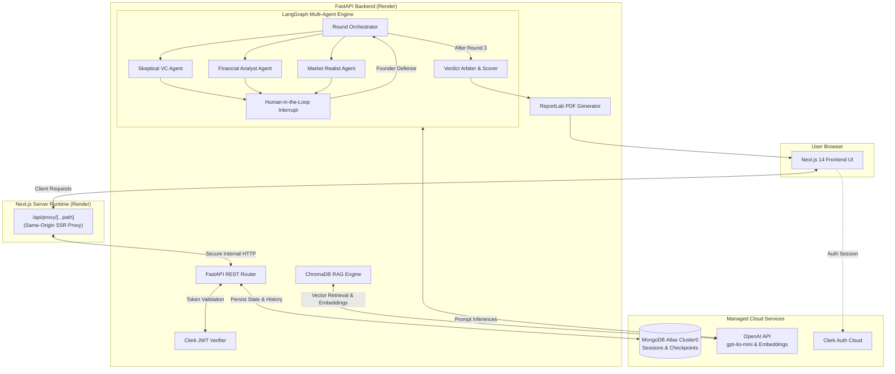

# 😈 Devil's Advocate Panel

> **Autonomous Multi-Agent AI Investment Committee that stress-tests startup pitches, uncovers fatal assumptions, and generates institutional-grade investment memos.**

[](https://fastapi.tiangolo.com/)
[](https://nextjs.org/)
[](https://langchain-ai.github.io/langgraph/)
[](https://www.mongodb.com/atlas)
[](https://clerk.com/)
[](LICENSE)

---

## 🌐 Live Deployments

| Component | Deployment URL | Description |
| :--- | :--- | :--- |
| **Frontend Web App** | [https://devils-advocate-frontend.onrender.com](https://devils-advocate-frontend.onrender.com) | Interactive Next.js 14 Web Application |
| **Backend API** | [https://devils-advocate-backend.onrender.com](https://devils-advocate-backend.onrender.com) | FastAPI REST API, LangGraph Agents & Docs |
| **API Health Status** | [https://devils-advocate-backend.onrender.com/health](https://devils-advocate-backend.onrender.com/health) | Live Atlas DB & Vector Store Status Check |
| **Interactive Docs** | [https://devils-advocate-backend.onrender.com/docs](https://devils-advocate-backend.onrender.com/docs) | Swagger UI API Documentation |

---

## 📖 Overview

**Devil's Advocate Panel** simulates a brutal, high-stakes venture capital partner meeting. Most founders practice pitching in echo chambers of polite encouragement. This platform subjects startup ideas to three specialized, adversarial AI agents who cross-examine every assumption, cite historical failure cases, stress-test financial projections, and produce an unvarnished investment verdict.

---

## ⚡ Core Features

- **🎭 Tri-Agent Adversarial Panel**:
  - **Skeptical VC**: Attacks competitive moats, network effects, distribution advantages, and commoditization risks.
  - **Financial Analyst**: Dissects unit economics (CAC, LTV, payback period), burn rates, gross margins, and pricing models.
  - **Market Realist**: Identifies regulatory traps, macro headwinds, realistic SOM vs. inflated TAM, and platform dependencies.
- **📚 Domain-Specific RAG Grounding**:
  - Real-time retrieval against curated startup failure case studies (Quibi, Theranos, Fast, WeWork, Segway) and B2B/B2C SaaS benchmark databases using ChromaDB vector search.
  - Agent critiques cite real market precedent and empirical failure modes.
- **🔄 3-Round Interactive Crucible**:
  - Progressive 3-stage cross-examination powered by **LangGraph** state machine.
  - Human-in-the-loop interruption mechanism (`interrupt_before=["await_user"]`).
  - Adaptive difficulty: agents formulate follow-up questions by cross-examining founder defenses from previous rounds.
- **⚖️ Weighted Scoring & Verdict Arbiter**:
  - Multi-criteria weighted algorithmic evaluation: Market Viability (25%), Defensibility (25%), Unit Economics (25%), Execution & Agility (15%), Timing & Scalability (10%).
  - Categorical verdict output: `STRONG_INVEST`, `LEAN_INVEST`, `MORE_DATA`, `PASS`, `HARD_PASS`.
  - Actionable **Weakness Matrix** (ranked by `HIGH`, `MEDIUM`, `LOW` severity) and strategic **Pivot Roadmap**.
- **📄 Instant PDF Investment Memo**:
  - One-click generation of institutional-grade PDF memos via ReportLab.
  - Contains complete dialogue audit transcripts, visual metric tables, and strategic recommendations.
- **🔐 Clerk Authentication & Session Persistence**:
  - Seamless authentication via Clerk (Google, GitHub, Email).
  - MongoDB Atlas production database storing user pitch histories, debate sessions, and state checkpoints.

---

## 🏗️ Architecture



---

## 🛠️ Step-by-Step Project Implementation Journey

Here is the complete chronological record of how the Devil's Advocate Panel was built, optimized, and deployed:

### Phase 1: Architectural Foundation & Domain Modeling
- Designed the core data models using **Pydantic** ([schemas/pitch.py](backend/app/schemas/pitch.py), [schemas/session.py](backend/app/schemas/session.py)).
- Formulated the multi-agent persona specifications and prompt templates.
- Initialized FastAPI application structure with async modular routing.

### Phase 2: RAG Pipeline & Knowledge Ingestion
- Built the domain knowledge repository in `backend/knowledge/` containing curated startup post-mortems, SaaS benchmarks, and unit economic comp sheets.
- Implemented [rag_service.py](backend/app/services/rag_service.py) with ChromaDB and OpenAI `text-embedding-3-small` for semantic similarity search.
- Integrated background task pre-indexing to ensure instantaneous vector queries during agent generation turns.

### Phase 3: LangGraph State Machine & Multi-Agent Orchestration
- Developed the 3-agent panel in [agents/](backend/app/agents/):
  - [vc_agent.py](backend/app/agents/vc_agent.py): Deep defensibility analysis.
  - [financial_agent.py](backend/app/agents/financial_agent.py): Unit economic scrutiny.
  - [market_agent.py](backend/app/agents/market_agent.py): Market dynamics and regulatory hazards.
- Constructed the cyclic LangGraph workflow in [agent_graph.py](backend/app/agents/agent_graph.py) with dynamic state transitions, 3-round counters, and human-in-the-loop interruption triggers (`await_user`).
- Built the `MongoStateCheckpointer` to enable resumable sessions across asynchronous user turns.

### Phase 4: Scoring Arbiter & PDF Memo Engine
- Built [verdict_service.py](backend/app/services/verdict_service.py) with a composite scoring algorithm (0-10), categorical verdict classification, weakness severity ranking, and strategic pivot planning.
- Implemented [pdf_service.py](backend/app/services/pdf_service.py) using **ReportLab** to generate styled, executive investment memos with tables, callout banners, and complete interrogation transcripts.

### Phase 5: Modern Glassmorphic Frontend Development
- Built responsive **Next.js 14 (App Router)** frontend with Tailwind CSS and Framer Motion.
- Created pitch intake wizard ([PitchForm.tsx](frontend/components/PitchForm.tsx)) with real-time field validation and domain categorization.
- Engineered dynamic multi-round debate interface ([session/[id]/page.tsx](frontend/app/session/[id]/page.tsx)) showing live typing indicators, individual agent feedback cards, and turn counters.
- Built interactive Verdict & Memo visualizer ([session/[id]/verdict/page.tsx](frontend/app/session/[id]/verdict/page.tsx)) with animated radial score gauges, weakness matrices, and PDF download triggers.

### Phase 6: Clerk Authentication & Production MongoDB Atlas
- Integrated **Clerk Authentication** across frontend ([layout.tsx](frontend/app/layout.tsx), [Navbar.tsx](frontend/components/Navbar.tsx), [middleware.ts](frontend/middleware.ts)) and backend ([auth.py](backend/app/core/auth.py)).
- Created User Pitch History dashboard ([history/page.tsx](frontend/app/history/page.tsx)) allowing users to browse past pitches and download saved memos.
- Connected **MongoDB Atlas Cluster0** with connection pooling (`maxPoolSize=50`), health verification endpoints, and automated indexing.

### Phase 7: Production Optimization, Deployment & Live Verification
- **512MB RAM Optimization**: Streamlined Next.js with `output: "standalone"`, optimized Docker build contexts, and made backend RAG initialization non-blocking.
- **Port Dynamic Binding**: Configured `"start": "next start"` to bind seamlessly to Render's dynamic `$PORT` environment variable.
- **Same-Origin Proxy Solution**: Built `/api/proxy/[...path]` in Next.js to eliminate CORS preflight latency and prevent browser adblockers (`ERR_BLOCKED_BY_CLIENT`) from interfering with backend requests.
- **Live Verification**: Validated end-to-end user flow on Render production services, confirmed green 🟢 **API Online** status indicator, and verified all 17 unit/integration test suites.

---

## 🧰 Tech Stack Matrix

| Area | Technologies Used |
| :--- | :--- |
| **Frontend** | Next.js 14, React 18, TypeScript, Tailwind CSS, Framer Motion, Lucide Icons |
| **Backend** | Python 3.11+, FastAPI, Uvicorn, Pydantic v2, HTTPX |
| **Multi-Agent Orchestration** | LangGraph, LangChain, OpenAI GPT-4o-mini |
| **Vector Search / RAG** | ChromaDB, OpenAI `text-embedding-3-small` |
| **Database** | MongoDB Atlas, Motor (Async Python Driver) |
| **Authentication** | Clerk Auth (`@clerk/nextjs` + FastAPI JWT Introspection) |
| **Document Generation** | ReportLab (PDF Generation Engine) |
| **Hosting & CI/CD** | Render (Web Services), GitHub Actions / Git Version Control |

---

## 🚀 Getting Started (Local Development)

### Prerequisites
- **Python 3.11+**
- **Node.js 18+** & `npm`
- **MongoDB Atlas** account (or local MongoDB 6+)
- **OpenAI API Key**
- **Clerk API Keys** (Optional for local public browsing)

---

### 1. Backend Setup

```bash
# Navigate to backend directory
cd backend

# Create and activate virtual environment
python -m venv venv
# On Windows:
.\venv\Scripts\activate
# On macOS/Linux:
source venv/bin/activate

# Install dependencies
pip install -r requirements.txt

# Create environment configuration file
cp .env.example .env
```

Configure your `.env` in `backend/`:
```env
OPENAI_API_KEY=your_openai_api_key_here
MONGODB_URL=mongodb+srv://<username>:<password>@cluster0.xxxxx.mongodb.net/?retryWrites=true&w=majority
DATABASE_NAME=devils_advocate
CORS_ORIGINS=["http://localhost:3000","http://127.0.0.1:3000","https://devils-advocate-frontend.onrender.com"]
CLERK_SECRET_KEY=your_clerk_secret_key_here
CLERK_PUBLISHABLE_KEY=your_clerk_publishable_key_here
```

Start the FastAPI development server:
```bash
uvicorn app.main:app --host 0.0.0.0 --port 8999 --reload
```
API will be available at `http://localhost:8999` (Swagger UI at `http://localhost:8999/docs`).

---

### 2. Frontend Setup

```bash
# Navigate to frontend directory
cd ../frontend

# Install dependencies
npm install

# Create environment configuration file
cp .env.example .env.local
```

Configure your `.env.local` in `frontend/`:
```env
NEXT_PUBLIC_BACKEND_URL=http://localhost:8999
NEXT_PUBLIC_CLERK_PUBLISHABLE_KEY=your_clerk_publishable_key_here
CLERK_SECRET_KEY=your_clerk_secret_key_here
```

Start the Next.js development server:
```bash
npm run dev
```
Frontend will be available at `http://localhost:3000`.

---

## 🧪 Testing

Run backend test suites:
```bash
cd backend
pytest tests/ -v
```

Verify MongoDB Atlas connectivity:
```bash
python scripts/verify_mongo_atlas.py
```

Run frontend production build verification:
```bash
cd frontend
npm run build
```

---

## 📡 API Reference

| Method | Endpoint | Description |
| :--- | :--- | :--- |
| `GET` | `/health` | System health check (MongoDB Atlas & RAG status) |
| `POST` | `/api/pitches/` | Submit new startup pitch dossier and initialize session |
| `GET` | `/api/pitches/history` | Retrieve pitch history for authenticated user |
| `GET` | `/api/sessions/{session_id}` | Get session details, dialogue history, and current round state |
| `POST` | `/api/sessions/{session_id}/respond` | Submit founder defense for the current interrogation round |
| `GET` | `/api/sessions/{session_id}/verdict` | Fetch final investment verdict, metric scores, and weakness matrix |
| `GET` | `/api/sessions/{session_id}/pdf` | Stream generated institutional PDF investment memo |

---

## 📄 License

This project is licensed under the **MIT License** — see the [LICENSE](LICENSE) file for details.