# 🏛️ Devil's Advocate Panel - System Architecture

This document describes the high-level and component architecture of the **Devil's Advocate Panel**, outlining the technical stack, module relationships, data flow, and infrastructure design.

---

## 🗺️ Architectural Diagram

```mermaid
flowchart TD
    subgraph ClientLayer ["1. Frontend Client Tier (Next.js 14 App Router)"]
        UI["Modern Glassmorphic UI<br/>(Tailwind CSS + Framer Motion)"]
        PitchWizard["Pitch Intake Form & PDF Dropzone<br/>(PitchForm.tsx)"]
        DebateArena["Multi-Round Interrogation Arena<br/>(session/[id]/page.tsx)"]
        VerdictDashboard["Verdict Visualizer & Radar Gauges<br/>(session/[id]/verdict/page.tsx)"]
        HistoryView["User Pitch History & Transcripts<br/>(history/page.tsx)"]
        McpModal["MCP Control Center Modal<br/>(ON / OFF Switches)"]
        ClerkUI["Clerk Auth Provider & Buttons<br/>(AuthProvider.tsx)"]
    end

    subgraph EdgeGateway ["2. Serverless Edge Gateway (SSR API Proxy)"]
        Proxy["/api/proxy/[...path]<br/>(Same-Origin HTTP Proxy Gateway)"]
    end

    subgraph BackendApp ["3. FastAPI Backend Core Engine (Render Container)"]
        FastAPIRouter["FastAPI REST Application (main.py)"]
        
        subgraph SecurityAuth ["Authentication & Security"]
            ClerkVerifier["Clerk JWT Token Introspector"]
            Sanitizer["Input Sanitizer & XSS Filter"]
        end
        
        subgraph GraphEngine ["LangGraph Multi-Agent Orchestrator"]
            StateGraph["Cyclic StateGraph (PanelState)"]
            NodeOrchestrator["Round Orchestrator Node"]
            NodeVC["Skeptical VC Node"]
            NodeFA["Financial Analyst Node"]
            NodeMR["Market Realist Node"]
            NodeArbiter["Verdict Arbiter Node"]
            Checkpointer["MongoStateCheckpointer"]
        end

        subgraph RAGEngine ["Retrieval-Augmented Generation (RAG)"]
            VectorStore["ChromaDB Vector Store"]
            Chunker["Markdown Header & Semantic Chunker"]
            KnowledgeBase["Startup Post-Mortems & SaaS Benchmarks"]
        end

        subgraph MCPHub ["Model Context Protocol (MCP) Hub"]
            MCPService["MCP Coordinator Service"]
            TavilyTool["Tavily Live Web Scraping Tool"]
            GitHubTool["GitHub Tech Audit Tool"]
            PDFTool["PyPDF Pitch Deck Parser Tool"]
        end

        subgraph PDFEngine ["Institutional Document Generator"]
            ReportLab["ReportLab PDF Builder (Styles, Charts, Tables)"]
        end
    end

    subgraph CloudInfra ["4. Managed Cloud Infrastructure"]
        Atlas[("MongoDB Atlas Cluster0<br/>(Pitches, Sessions, Dialogue, Checkpoints)")]
        GroqCloud["Groq Cloud API<br/>(openai/gpt-oss-120b - 500 T/s)"]
        GeminiCloud["Google Gemini API<br/>(gemini-2.5-flash)"]
        ClerkCloud["Clerk Identity Provider"]
    end

    %% Flow Connections
    ClientLayer <-->|User Events & Mutations| Proxy
    ClerkUI <-->|OAuth / Passkeys| ClerkCloud
    McpModal -.->|Sync Storage & Event| PitchWizard
    
    Proxy <-->|Fast Same-Network HTTP| FastAPIRouter
    FastAPIRouter --> ClerkVerifier
    FastAPIRouter --> Sanitizer
    FastAPIRouter <-->|Store & Load Sessions| Atlas

    FastAPIRouter <--> GraphEngine
    GraphEngine <-->|Context Queries| RAGEngine
    GraphEngine <-->|External Diligence| MCPHub
    GraphEngine <-->|Inference Calls| GroqCloud
    GraphEngine <-->|Fallback LLM| GeminiCloud
    GraphEngine <-->|State Checkpoints| Checkpointer
    Checkpointer <--> Atlas

    MCPHub -.->|Live Web Queries| GroqCloud
    MCPHub -.->|GitHub REST API| CloudInfra

    FastAPIRouter --> PDFEngine
    PDFEngine -->|PDF Stream| Proxy
```

---

## 🧩 Architectural Layers

### 1. Frontend Client Tier (Next.js 14)
- **Framework**: Next.js 14 with App Router (`/app`).
- **Styling**: Tailwind CSS with custom glassmorphism design tokens (`darkbg-950`, `darkbg-900`, `rose-600`, `cyan-400`).
- **Interactivity**: Framer Motion for smooth agent turn transitions and animated radial score gauges.
- **Key Modules**:
  - `components/PitchForm.tsx`: Dynamic form supporting manual entry and PDF deck ingestion.
  - `components/McpModal.tsx`: Control center for toggling MCP tools with real-time `mcp-config-changed` event broadcasting.
  - `components/Navbar.tsx`: Real-time backend health check and dynamic live MCP count badge.
  - `app/session/[id]/page.tsx`: Live 3-round crucible interface with typewriter effects and round progress indicators.
  - `app/session/[id]/verdict/page.tsx`: Final investment decision memo visualizer.

---

### 2. Edge Gateway & SSR Proxy
- **Route**: `frontend/app/api/proxy/[...path]/route.ts`.
- **Purpose**:
  - Proxies all client API requests through the Next.js server runtime to the backend container.
  - **Eliminates CORS preflight delay** and avoids `ERR_BLOCKED_BY_CLIENT` browser adblocker interference.
  - Provides a single origin for cookies and header pass-through.

---

### 3. FastAPI Backend Core Engine
- **Runtime**: Python 3.11+ ASGI on Uvicorn.
- **Endpoints**:
  - `POST /api/pitches/`: Ingests pitches and initializes multi-agent sessions.
  - `POST /api/pitches/parse-deck`: Ingests `.pdf` files via `python-multipart` and returns structured pitch fields.
  - `GET /api/sessions/{id}`: Retrieves session state and round transcripts.
  - `POST /api/sessions/{id}/respond`: Resumes LangGraph execution with founder defense.
  - `GET /api/sessions/{id}/verdict`: Computes and retrieves final multi-criteria evaluation.
  - `GET /api/sessions/{id}/pdf`: Streams the executive ReportLab PDF investment memo.
  - `GET /api/mcp/status`: Reports live connectivity, quotas, and capabilities of connected MCP tools.
  - `GET /health`: Health checks for database, vector store, and LLM connectivity.

---

### 4. Multi-Agent Orchestration (LangGraph)
- **State Representation (`PanelState`)**:
  - `pitch`: Pitch dossier metadata.
  - `current_round`: Integer (1, 2, or 3).
  - `challenges`: Map of agent responses per round.
  - `founder_responses`: Map of founder defenses per round.
  - `verdict`: Final scored investment memo.
- **State Checkpointing (`MongoStateCheckpointer`)**:
  - Serializes state after each agent generation turn into MongoDB Atlas.
  - Uses `interrupt_before=["await_user"]` to pause execution until the founder provides defense arguments.

---

### 5. Retrieval-Augmented Generation (RAG)
- **Vector Database**: ChromaDB embedded persistent store.
- **Embeddings**: OpenAI `text-embedding-3-small` / TF-IDF semantic embeddings.
- **Knowledge Base**: Curated post-mortems of failed startups (Quibi, Theranos, Fast, WeWork) and verified SaaS financial comp tables.
- **Retrieval Strategy**: Cosine similarity top-k ($k=3$) injected into agent prompts as empirical evidence.

---

### 6. Model Context Protocol (MCP) Connectors Hub
- **Architecture**: Modular tool pattern implementing a unified `BaseMCPTool` interface.
- **Tools**:
  - `TavilySearchTool`: Real-time competitor discovery and pricing page analysis.
  - `GitHubDiligenceTool`: Public repository audit (commit velocity, language breakdown, star metrics).
  - `PitchDeckParserTool`: PDF slide text extraction and structured parsing via PyPDF.
- **State Toggles**: Client-side `localStorage` persistence with backend graceful bypass when toggled OFF.

---

### 7. Managed Cloud Services
- **Database**: MongoDB Atlas Cluster0 (Async Motor driver with connection pooling `maxPoolSize=50`).
- **Primary LLM**: Groq Cloud API running `openai/gpt-oss-120b` for ultra-low latency generation (< 2.5s per agent).
- **Secondary LLM**: Google Gemini API running `gemini-2.5-flash` with automatic failover.
- **Authentication**: Clerk Identity Platform (JWT verification via `CLERK_SECRET_KEY`).
