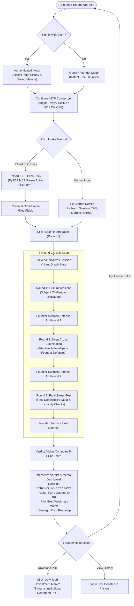

# 👤 User Query & Interaction Workflow

This document provides an in-depth walkthrough of the **User Interaction & Query Execution Workflow**, detailing every step a founder experiences when interacting with the **Devil's Advocate Panel**.

---

## 🗺️ Complete User Journey Flowchart

---

## 🔬 Step-by-Step Technical Lifecycle of a Query

### Step 1: Landing & Authentication Choice
- **User Action**: The founder opens `https://devils-advocate-frontend.onrender.com`.
- **Options**:
  - **Guest / Founder Mode**: Complete the entire 3-round gauntlet immediately without login.
  - **Clerk Authentication**: Sign in via Google, GitHub, or Email to persist pitch sessions and download past memos in `/history`.

---

### Step 2: Pitch Intake & MCP PDF Ingestion
- **User Action**: 
  - **Option A (Manual)**: Enters Startup Name, Tagline, Problem, Solution, ICP/TAM, Business Model, Traction, and optional GitHub URL.
  - **Option B (PDF Deck)**: Drops a `.pdf` pitch deck into the dropzone.
- **Behind the Scenes**:
  - The PDF is sent to `POST /api/pitches/parse-deck`.
  - `PitchDeckParserTool` extracts slide text and prompts the LLM to structure the dossier.
  - The form fields populate automatically with a green confirmation alert: `Auto-filled pitch from "pitch_deck.pdf" via MCP Parser!`.

---

### Step 3: MCP Tool Controls & Diligence Settings
- **User Action**: The user can click **"🔌 MCP Connectors"** in the top navigation bar or use the inline switch above the GitHub URL field.
- **Toggle Options**:
  - **Tavily Web Search**: Enable/disable live competitor scraping.
  - **GitHub Diligence**: Enable/disable repository commit velocity and architecture audits.
  - **Pitch Deck Parser**: Enable/disable PDF auto-fill.
- **State Sync**: Updates `localStorage` and broadcasts a `mcp-config-changed` event to adjust the navbar badge (e.g. `3 ON` -> `2 ON`).

---

### Step 4: Submission & Round 1 Generation
- **User Action**: Clicks **"Begin Interrogation (Round 1)"**.
- **Execution Flow**:
  1. `POST /api/pitches/` creates a MongoDB record and initializes `session_id`.
  2. Browser redirects to `/session/{session_id}`.
  3. `LangGraph` executes `orchestrator_node` -> `vc_agent_node` -> `financial_agent_node` -> `market_agent_node`.
  4. The 3 challenges are rendered with distinctive agent badges, severity tags (`HIGH`, `MEDIUM`, `LOW`), and cited failure precedents.
  5. The graph halts on `interrupt_before=["await_user"]`.

---

### Step 5: Multi-Round Interrogation Loop (Rounds 1–3)
- **User Action**: The founder types their counter-arguments into the defense textarea and clicks **"Submit Defense & Proceed to Next Round"**.
- **Execution Flow**:
  1. `POST /api/sessions/{session_id}/respond` sends the response to the backend.
  2. `MongoStateCheckpointer` reloads the state and updates `founder_responses[current_round]`.
  3. The agents analyze the defense against RAG data and formulate tougher follow-up questions for Round 2 and Round 3.
  4. The UI displays typing indicators, updates the round progress counter (`Round 2 of 3`), and animates newly generated challenges.

---

### Step 6: Verdict Arbiter & Interactive Memo Dashboard
- **User Action**: After submitting Round 3 defenses, the platform transitions to `/session/{session_id}/verdict`.
- **Display Components**:
  - **Investment Decision Banner**: Displays categorical verdict (`STRONG_INVEST`, `LEAN_INVEST`, `MORE_DATA`, `PASS`, `HARD_PASS`) with color-coded styling.
  - **5-Pillar Score Cards**: Visual radial score gauges out of 10.0 with detailed rationale.
  - **Weakness Matrix**: Categorized cards sorted by severity (`HIGH`, `MEDIUM`, `LOW`).
  - **Pivot Roadmap**: Bulleted strategic milestones for de-risking the business model.

---

### Step 7: Exporting Institutional PDF Memo
- **User Action**: Clicks **"Download Investment Memo (.PDF)"**.
- **Execution Flow**:
  1. `GET /api/sessions/{session_id}/pdf` invokes `PDFReportGenerator`.
  2. **ReportLab** builds a document with branded headers, metric summary tables, weakness callouts, and verbatim cross-examination transcripts.
  3. The PDF is streamed directly to the browser for instant download.

---

### Step 8: User Pitch History & Re-visitation
- **User Action**: Authenticated users can navigate to `/history`.
- **Display**: Lists all previous startup pitches, initial submission dates, overall scores, and one-click PDF re-download links.
