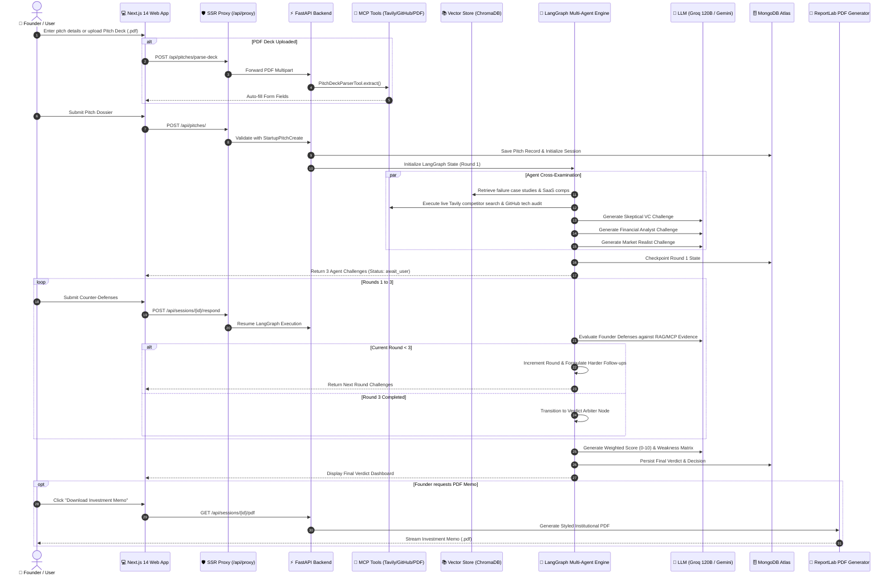
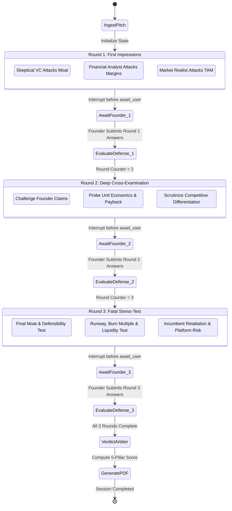

# 🔄 Devil's Advocate Panel - Complete System Workflow

This document details the end-to-end execution workflow of the **Devil's Advocate Panel**, tracing the lifecycle of a startup pitch from initial intake to final investment memo generation.

---

## 🧭 Workflow High-Level Overview

---

## 📋 Phase-by-Phase Workflow Breakdown

### 1. Ingestion & Pre-Diligence Phase
1. **User Action**: The founder fills out the pitch dossier or drops a `.pdf` pitch deck into the upload area.
2. **MCP Parsing**: If a PDF is uploaded, `PitchDeckParserTool` extracts slide text and prompts the LLM to structure problem, solution, TAM, business model, traction, and fundraising goal.
3. **Session Creation**: `POST /api/pitches/` creates a MongoDB session document with a unique `session_id` and round counter `current_round = 1`.

---

### 2. External Diligence & RAG Context Retrieval
Before agents generate questions:
- **Tavily MCP Search**: If enabled, searches for stealth competitors, alternative platforms, and pricing benchmarks.
- **GitHub MCP Audit**: If a repository URL is supplied and enabled, audits commit frequency, language distribution, and star count.
- **ChromaDB Semantic Retrieval**: Queries the local vector store for historical failure modes (e.g. Quibi's burn rate, Fast's CAC explosion) and standard SaaS metrics.

---

### 3. The 3-Round Interrogation Loop (LangGraph Crucible)

---

### 4. Verdict Arbiter & Multi-Criteria Scoring

The **Verdict Arbiter** analyzes the entire 3-round dialogue transcript and calculates a 0–10 score based on 5 weighted pillars:

| Evaluation Pillar | Weight | Description |
| :--- | :---: | :--- |
| **Market Viability & TAM** | **25%** | Realistic serviceable market vs. inflated top-down TAM. |
| **Moat & Defensibility** | **25%** | Technical barrier, proprietary IP, switching costs, and network effects. |
| **Unit Economics & Business Model** | **25%** | Gross margin profile, LTV/CAC ratio, payback velocity, and pricing power. |
| **Execution Agility & Founder Clarity** | **15%** | Quality of defenses, intellectual honesty, and responsiveness under pressure. |
| **Timing & Scalability** | **10%** | Market timing tailwinds and capital efficiency at scale. |

#### Categorical Investment Decisions
- **`STRONG_INVEST`** (Score $\ge 8.5$): Exceptional defensibility, scalable unit economics, and rock-solid market timing.
- **`LEAN_INVEST`** (Score $7.0 - 8.4$): Promising business model with minor operational or market risks.
- **`MORE_DATA`** (Score $5.5 - 6.9$): Unproven assumptions requiring customer validation and pilot data.
- **`PASS`** (Score $4.0 - 5.4$): Significant structural flaws, weak moat, or unsustainable CAC.
- **`HARD_PASS`** (Score $< 4.0$): Fatal unit economics, direct incumbent commoditization, or regulatory blockers.

---

### 5. Institutional PDF Memo Export

The backend `PDFReportGenerator` ([backend/app/pdf/generator.py](file:///d:/projects/devil's_advocate_panel/backend/app/pdf/generator.py)) compiles an executive ReportLab PDF featuring:
- Executive Summary & Company Metadata.
- Final Investment Decision Banner with color-coded score gauge.
- 5-Pillar Evaluation Score Breakdown Table.
- Prioritized Weakness Matrix (categorized by `HIGH`, `MEDIUM`, and `LOW` severity).
- Actionable Strategic Pivot & De-risking Roadmap.
- Complete 3-Round Cross-Examination Dialogue Transcripts.
